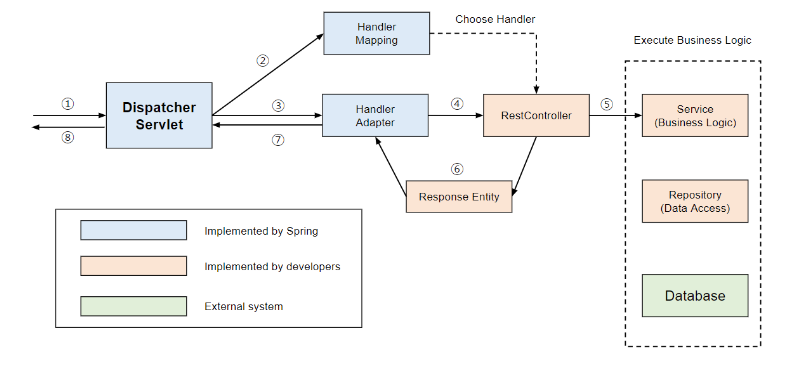

<h1 style="font-size: 48px;">DispatcherServlet and Spring</h1>

1. Spring MVC에서 http요청은 WAS를 통해 요청을 먼저 받고 DispatcherServlet에게 요청이 전달된다.  
   우선적으로 요청을 먼저 받아 컨트롤러에게 나눠주기 때문에 **프론트 컨트롤러 패턴**이라고 한다. 
2. DispatcherServlet는 application context에 등록된 bean이다.

